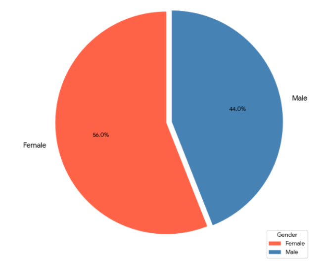

# Mall Customers Analysis

This project uses Python to analyze a customer dataset from a mall.

## Dataset

The dataset includes the following columns:

- **CustomerID**: Unique identifier for each customer
- **Gender**: Male or Female
- **Age**: Age of the customer
- **Annual Income (k$)**: Annual income in thousands of dollars
- **Spending Score (1-100)**: Score assigned by the mall based on customer behavior

## Loading and reading the dataset

## Basic statistics

## Distribution Analysis of the customer data

<table>
  <tr>
    <td>
      
    </td>
    <td>
      
    </td>
    <td>
      
    </td>
  </tr>
</table>

### Analysis

The visuals reveals the distribution of three key customer metrics. The visualizations used were **Histograms with Kernel Density Estimates (KDE)**.

| Metric | Key Takeaway | Distribution Shape |
| :--- | :--- | :--- |
| **Age** | The customer base is dominated by **Young Adults (25-40)**, with a secondary, smaller segment of middle-aged customers (45-55). | Mostly Bimodal |
| **Annual Income (k\$)** | The majority of customers fall into a **mid-income bracket** ($50k to $80k). | Right-Skewed |
| **Spending Score (1-100)** | Most customers exhibit an **average spending pattern**, clustering between 40 and 70. | Near-Normal |

The data indicates a customer base primarily composed of **mid-income young adults** with average spending habits. This pattern suggests the need for **customer segmentation** to identify outliers and higher-value groups.

---

## Gender Based Distribution

<table>
  <tr>
    <td></td>
    <td></td>
  </tr>
  <tr>
    <td></td>
    <td></td>
  </tr>
</table>

### Gender-Based Analysis Summary

The comparative analysis by gender highlights key differences across the customer base.

| Visualization | Key Finding | Interpretation |
| :--- | :--- | :--- |
| **Gender Pie Chart** | The customer base is majority **Female (56%)** compared to Male (44%). | Any communication or marketing effort will naturally reach more female customers. |
| **Age by Gender (KDE)** | **Female customers are significantly younger**, with the peak density around age **30**. Male customers have a broader, flatter age distribution. | Young adult females (ages 25-40) represent a highly concentrated segment. |
| **Income by Gender (KDE)** | **Annual Income distributions are nearly identical** for both genders, centering in the **mid-income range** ($60k - $70k). | Income level is not a differentiator between the male and female segments. |
| **Spending Score by Gender (KDE)** | **Female customers** are tightly clustered in the **average spending range (45-60)**. **Male customers** have a higher proportion in the **low-spending range (0-40)**. | Female customers are more consistent, reliable spenders, whereas male customers are more likely to be low-volume purchasers. |

---

## Relationship Between Annual Income and Spending Score

### Segmentation Analysis: Income vs. Spending

This scatter plot is the foundation for customer segmentation, revealing **five distinct clusters** based on the relationship between Annual Income and Spending Score. This structure strongly suggests that **K-Means Clustering** will be an effective modeling technique.

| Cluster | Income Range (k\$) | Spending Score (1-100) | Segmentation Profile | Business Strategy |
| :--- | :--- | :--- | :--- | :--- |
| **High-Value VIP** | High ($70+)| High ($75-100) | Wealthy and high-spending. | **Retention & Loyalty:** Focus on exclusive services and personalized offers. |
| **Average Market** | Medium ($40-70)| Medium ($40-60) | The largest and most typical customer group. | **Volume & Cross-Sell:** Standard promotions and broad marketing campaigns. |
| **High Potential** | High ($70+)| Low ($0-40) | High income but currently under-spending. | **Activation:** Investigate reasons for low spending and target with product recommendations. |
| **Budget Spender** | Low ($15-40)| Low ($0-40) | Low income and low spending. | **Cost Sensitivity:** Focus on value deals, discounts, and clear promotions. |
| **Impulsive Spender** | Low ($15-40)| High ($70-100) | Low income but high spending. | **Risk Management:** Focus on immediate sales volume, but monitor for potential churn/risk. |

---

## Correlation Matrix of Customer Features

### Feature Correlation Matrix Summary

| Relationship | Correlation Coefficient | Interpretation |
| :--- | :--- | :--- |
| **Age vs. Spending Score** | **-0.33** | **Weak Negative Correlation.** As customers get older, their spending score shows a slight tendency to decrease. |
| **Annual Income vs. Spending Score** | **+0.010** | **NO Significant Linear Correlation.** The near-zero value confirms that the five distinct clusters seen in the scatter plot are non-linear patterns. |
| **Age vs. Annual Income** | **-0.012** | **NO Significant Linear Correlation.** Age and income are independent in this dataset. |

---

## Clustering Analysis Summary

This analysis involved three stages of K-Means clustering to robustly segment the mall customers.

1. Univariate & Bivariate Segmentation

The initial stages established key market structure:

- Univariate (Income): Optimal K=3 for high-level income grouping.

- Bivariate (Income vs. Spending): Optimal K=5, defining the five classic customer segments (e.g., High-Value, Careful, etc.), which is the main marketing deliverable.

<table>
  <tr>
  <td>
      
    </td>
    <td>
      
    </td>
  </tr>
</table>

2. Multivariate (Full Feature) Segmentation

This stage provides the most actionable and accurate model:

- Prerequisite: Feature Scaling (StandardScaler) was mandatory to prevent bias from feature range differences.

- Optimal K (from Elbow Plot): K=4 was determined to be the best-fitting number of segments for the full dataset (Age, Income, Spending, Gender).

- Final Output: This provides the final, nuanced customer profiles for strategic decision-making.

## Final Conclusion: Strategic Value of Customer Segmentation

The analysis confirms the Mall Customers dataset is **highly suitable for actionable segmentation**, but its value is entirely dependent on **Multivariate Analysis**, not simple correlation.

### Key Analytical Findings

1. **Low Predictability:** The most critical finding is the **near-zero linear correlation** between **Annual Income** and **Spending Score** ($\approx 0.01$). This proves that income alone is unreliable for predicting a customer's spending habits.

2. **Strategic Segmentation:** The analysis successfully defined two optimal segmentation models:
    - **Bivariate Model (K=5):** Ideal for visualizing and communicating the five classic customer types (e.g., High-Value Targets, Careful Spenders). This is the key deliverable for **marketing campaign design**.
    - **Multivariate Model (K=4):** The final, most **statistically robust** model. Determined by running K-Means on all **scaled features** (Age, Income, Spending, Gender), it provides the most comprehensive and nuanced customer profiles for **operational decision-making**.

## Actionable Recommendation

The organization should utilize the **$K=4$ or $K=5$ clusters** to immediately tailor marketing efforts, product development, and store layout to the specific needs and spending patterns of each identified customer segment.
